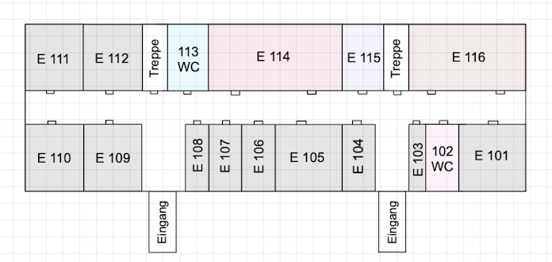

# Campus Navigator (Way2Class)

Diese Flutter-App bietet eine Navigation innerhalb eines Campus-Gebäudes. Mithilfe eines Graphen, der verschiedene Knoten (Räume, Flure, Treppen, Fahrstühle, etc.) repräsentiert, wird der kürzeste Pfad zwischen Start- und Zielpunkt berechnet. Die berechneten Pfade werden anschließend in natürliche, verständliche Wegbeschreibungen umgewandelt – unterstützt durch die Google Generative AI.

## Projektstruktur

Die Way2Class-App ist modular aufgebaut und folgt dem Clean Architecture-Prinzip. Die wichtigsten Verzeichnisse und Dateien sind wie folgt organisiert:

### Kern-Komponenten
```
lib/
├── core/  # Kernfunktionalitäten und Business-Logik
│   ├── generator/  # Komponenten zur Generierung von Routen
│   │   ├── instruction_generator.dart  # Generiert natürlichsprachliche Anweisungen
│   │   ├── path_generator.dart  # Berechnet den Pfad zwischen zwei Punkten
│   │   └── segment_generator.dart  # Wandelt Pfade in semantische Segmente um
│   ├── model/  # Datenmodelle der Anwendung
│   │   ├── campus_graph.dart  # Graph-Modell für den Campus
│   │   ├── node.dart  # Repräsentation eines Knotens (Raum, Flur, etc.)
│   │   ├── route_segment.dart  # Modell für Routensegmente
│   │   └── segment_metadata.dart  # Metadaten für Routensegmente
│   └── utils/  # Hilfsfunktionen
│       ├── extensions.dart  # String- und andere Erweiterungen
│       └── logger.dart  # Logging-Funktionalität
```

### Service-Schicht
```
lib/
├── service/  # Dienste und APIs
│   ├── api/  # API-Kommunikation
│   │   └── gemini_api.dart  # Anbindung an Google Gemini API
│   ├── security/  # Sicherheits-Services
│   │   └── security_manager.dart  # Ver- und Entschlüsselung von Cache-Daten
│   ├── campus_graph_service.dart  # Hauptservice für Campus-Navigation
│   ├── path_cache_service.dart  # Caching von berechneten Pfaden
│   └── theme_manager.dart  # Verwaltung des App-Themes
```

### Präsentationsschicht
```
lib/
├── pages/  # App-Seiten und UI
│   ├── debugging/  # Entwicklertools
│   │   ├── cache_stats_tab.dart  # Cache-Statistiken
│   │   ├── developer_panel.dart  # Haupt-Entwickleroptionen
│   │   ├── encryption_test_tab.dart  # Tests für Verschlüsselungsfunktionen
│   │   └── route_validator_tab.dart  # Validierung von Routen
│   ├── home/  # Hauptbereich der App
│   │   ├── components/  # UI-Komponenten der Hauptseite
│   │   │   ├── quick_access_panel.dart  # Schnellzugriff auf wichtige Funktionen
│   │   │   └── route_description.dart  # Anzeige der Wegbeschreibung
│   │   └── home_page.dart  # Hauptseite der App
│   ├── map/  # Kartenansicht
│   │   ├── floor_viewer.dart  # Betrachter für Etagenpläne
│   │   └── graph_view_screen.dart  # Visualisierung des Campus-Graphen
│   ├── settings/  # Einstellungen
│   │   └── settings_menu.dart  # Einstellungsmenü
│   └── map_view_toggle.dart  # Umschalter zwischen Karten- und Graphansicht
```

### Ressourcen
```
assets/  # Externe Ressourcen
├── floors/  # Etagenpläne als PNG-Dateien
│   ├── a_f0.png  # Haus A, Erdgeschoss
│   └── ...
├── haus_a/  # Graphdaten für Haus A
│   ├── haus_a_f0.json  # Erdgeschoss
│   └── ...
├── haus_b/  # Graphdaten für Haus B
├── haus_c/  # Graphdaten für Haus C
├── haus_d/  # Graphdaten für Haus D
└── haus_e/  # Graphdaten für Haus E
```

### Konfigurationsressourcen
```
lib/
├── constants/  # Konstanten und Typdefinitionen
│   ├── route_templates.dart  # Textvorlagen für Wegbeschreibungen
│   ├── theme/  # Theme-Definitionen
│   │   ├── dark_theme.dart  # Dunkles Theme
│   │   └── light_theme.dart  # Helles Theme
│   └── types.dart  # Typdefinitionen und Enums
├── di/  # Dependency Injection
│   └── service_locator.dart  # Registrierung von Services mit GetIt
└── main.dart  # Einstiegspunkt der Anwendung
```

### Hauptdateien

- **main.dart**: Initialisiert die App, Dependency Injection und Theme-Manager
- **campus_graph_service.dart**: Zentraler Service für das Laden des Graphen und die Berechnung von Routen
- **path_generator.dart**: Implementierung des bidirektionalen Suchalgorithmus
- **segment_generator.dart**: Umwandlung der berechneten Pfade in semantische Segmente
- **instruction_generator.dart**: Generierung natürlichsprachlicher Anweisungen aus Segmenten

### Datenhaltung

Die Anwendung verwendet mehrere Datenquellen:
- **JSON-Dateien**: Enthalten die Graphstruktur des Campus mit Knoten und Kanten
- **PNG-Dateien**: Visuelle Darstellung der Etagenpläne
- **Secure Storage**: Sichere Speicherung von Verschlüsselungsschlüsseln
- **SharedPreferences**: Persistenz von Benutzereinstellungen und Cache-Daten

## PDCA Wochenplan

### Woche 1 (20.–26. Februar 2025)

#### Plan (Planen)
- **Kartenintegration**: Methode zur Verarbeitung von PNG-Karten entwickeln  
- **API-Anbindung**: Gemini-API in das System integrieren  
- **UI-Funktionalität**: Interaktive Kartendarstellung mit Zoom und Dragging hinzufügen  
- **Benutzerinteraktion**: Raumauswahl über Dropdown und Chat-Integration mit Gemini  

#### Do (Umsetzen)
- PNG-Karten erfolgreich in Bytecode umgewandelt  
- API-Service für Gemini-Requests implementiert  
- Erste Version der UI mit `InteractiveViewer` für Kartensteuerung  
- Zwei `FloatingActionButtons` für Chat und Professorenliste ergänzt  
- Markdown-Widget für die Darstellung des Gemini-Responses integriert  

#### Check (Überprüfen)
- Tests zur Prompt-Generierung für bessere Wegbeschreibungen  
- Erste Optimierung der Text-Prompts durchgeführt  
- Error-Handling für API-Anfragen implementiert  
- Verschiedene Gemini-Modelle getestet, um bestes Ergebnis zu ermitteln  

#### Act (Anpassen)
- Verbesserungen an der Prompt-Generierung für klarere Antworten  
- Fehlerhandling optimiert, um Limits der API besser zu handhaben  
- UI-Elemente an Feedback angepasst (z. B. Darstellung der API-Antworten)  

### Woche 2 (27. Februar – 5. März 2025)

#### Plan (Planen)
- **Graph-Implementierung**: Erstellung eines Campus-Graphen mit JSON-Nodes und Edges  
- **Algorithmus-Entwicklung**: Implementierung von Dijkstra und A\*-Algorithmus zur Pfadberechnung  
- **Navigation & Optimierung**: Verbesserte Routenführung mit Schritt-/Distanzabschätzung  
- **Graph-Visualisierung**: Separate Ansicht zur Überprüfung der Graphstruktur  
- **Nutzerfreundlichkeit**: Autocomplete für Start- und Zielauswahl, Caching für schnellere Berechnungen  
- **UI-Anpassungen**: Einstellungen, farbliche Gruppierung, und eine Legende zur besseren Orientierung  

#### Do (Umsetzen)
- Campus-Graph als JSON-Struktur erstellt und visualisiert  
- Dijkstra und A\*-Algorithmus zur Navigation implementiert  
- Routenoptimierung mit sinnvoller Segmentierung der Flurabschnitte  
- Generative AI (`google_generative_ai`-Paket) für Wegbeschreibungen genutzt  
- Debugging und Fehlerbehebung für Routenberechnung durchgeführt  
- Einstellungsseite für Nutzer erstellt  
- Farbgruppen und Legende zur Raumklassifizierung hinzugefügt  
- A- und E-Gebäude überprüft und dokumentiert  

#### Check (Überprüfen)
- Routenberechnungen getestet und Fehler identifiziert  
- Debugging-Tools verbessert, um Probleme schneller zu finden  
- Farbliche Gruppierung und Legende auf Verständlichkeit geprüft  
- Navigationsergebnisse mit realen Wegen abgeglichen  

#### Act (Anpassen)
- Optimierungen am Graphen und Algorithmus basierend auf Debugging-Ergebnissen  
- Anpassung der Farbzuordnung für bessere Übersichtlichkeit  
- Verbesserte UI in den Einstellungen für einfachere Bedienung  
- Caching-Mechanismus für schnellere Routenberechnung verbessert  

### Woche 3 (6.-12. März 2025)

#### Plan (Planen)
- **Theme-Manager**: Implementierung eines Theme-Management-Systems mit Light- und Dark-Mode  
- **Professoren-Tabelle**: Extraktion und Umwandlung von HTML-Tabellen zur interaktiven Darstellung  
- **Wegbeschreibungsgenerierung**: Einführung einer strukturierten Generierung mit `PathGenerator`, `SegmentsGenerator` und `InstructionGenerator`  
- **A*-Optimierung**: Verbesserte Heuristik, Gewichtungsmultiplikatoren und effizientere Etagen-/Gebäudewechsel-Logik  
- **Logging & Visualisierung**: Einführung eines detaillierten Logging-Mechanismus zur Analyse der A*-Schritte  
- **Segment-Merging**: Zusammenführen angrenzender Segmente zur Vereinheitlichung der Routenbeschreibung  
- **JSON-Tool**: Entwicklung eines Skriptes zur Erstellung von JSON-Dateien für Raum- und Graphdaten  

#### Do (Umsetzen)
- **Theme-Management** als `ChangeNotifier` mit `Provider`-Pattern integriert  
- **Professoren-Tabelle** mit Echtzeit-Suche, Sortierung und interaktiven Elementen umgesetzt  
- **Neue Wegbeschreibungsgenerierung** mit strukturierten Segmenten implementiert  
- **A*-Optimierung** mit Gewichtungsmultiplikatoren und neuer Heuristik verbessert  
- **Logging-Mechanismus** für den A*-Algorithmus implementiert und visuell aufbereitet  
- **JSON-Daten** für Räume erstellt, Gitter-Koordinaten definiert und falsche Raumdaten korrigiert  

#### Check (Überprüfen)
- **Themenwechsel getestet** und UI-Anpassungen vorgenommen  
- **Wegbeschreibung validiert**: Generierte Anweisungen mit realen Wegen abgeglichen  
- **A*-Optimierung überprüft**: Performance und Routenqualität analysiert  
- **Logging-Visualisierung evaluiert**: Fehlerhafte Berechnungen durch Logs nachvollzogen  
- **Raumdaten abgeglichen** und fehlerhafte Informationen korrigiert  

#### Act (Anpassen)
- **Feinabstimmung des A*-Algorithmus** durch Anpassung der Gewichtungen  
- **Optimierung der JSON-Daten** für eine effizientere Verarbeitung  
- **Segment-Merging verbessert**, um noch präzisere Anweisungen zu erzeugen  
- **Erweiterung der Logging-Visualisierung** für detailliertere Debugging-Informationen  
- **Fehlende Raumdaten ergänzt** und Farblegende überarbeitet  

### Woche 4 (13.–19. März 2025)

#### Plan (Planen)
- **Gebäudezeichnungen**: Fertigstellung aller Gebäudezeichnungen für verschiedene Etagen  
- **JSON-Daten**: Erstellung der JSON-Dateien für das E- und A-Gebäude  
- **InstructionGenerator**: Entwicklung einer Klasse zur Generierung natürlicher Sprach-Anweisungen für die Navigation  
- **Visuelle Darstellung**: Tests zur optimalen Anzeige der Karten in der App  

#### Do (Umsetzen)
- **Alle Gebäudezeichnungen fertiggestellt**  
- **JSON-Dateien für E-Gebäude (1. & 2. OG) und A-Gebäude (EG – 3. OG) erstellt**  
- **InstructionGenerator implementiert** mit zufälliger Satzbaustein-Auswahl basierend auf Segmenttypen  
- **Korrekturen an JSON-Daten für A-Gebäude vorgenommen**  
- **Erste Tests zur Kartendarstellung in der App durchgeführt**  

#### Check (Überprüfen)
- **Gebäudezeichnungen überprüft**: Vergleich mit realen Grundrissen und Anpassung kleiner Details  
- **JSON-Daten validiert**: Strukturelle Fehler und fehlende Daten identifiziert und korrigiert  
- **InstructionGenerator getestet**: Generierte Wegbeschreibungen hinsichtlich Verständlichkeit und Natürlichkeit geprüft  
- **Kartendarstellung evaluiert**: Erste visuelle Tests zur Anzeige von Karten in der App  

#### Act (Anpassen)
- **JSON-Korrekturen** für das A-Gebäude durchgeführt  
- **InstructionGenerator weiter verfeinert**, um noch natürlichere Wegbeschreibungen zu erzeugen  
- **Erste Anpassungen an der Kartenvisualisierung vorgenommen**, um eine bessere Darstellung in der App zu gewährleisten  

### Woche 5 (20.-26. März 2025)

#### Plan (Planen)
- **String Extensions**: Implementierung nützlicher String-Methoden für die Verarbeitung von Texten  
- **Finalisierung des InstructionGenerators**: Erweiterung der Navigationsanweisungen durch Platzhalter-Ersetzung und optimierte Logik  
- **Optimierung der Raumsuche**: Verbesserung der Suchfunktion, sodass sie auch bei fehlenden Nullen korrekt arbeitet  
- **Treppen- und Aufzugserkennung**: Entwicklung eines Erkennungsmechanismus für vertikale Verbindungen  
- **Bevorzugung von Treppen**: Anpassung des Routing-Algorithmus zur priorisierten Nutzung von Treppen  

#### Do (Umsetzen)
- **String Extensions implementiert** (`capitalize()`, `addPeriod()`, `normalizeSpaces()`)  
- **InstructionGenerator finalisiert** mit präziseren Anweisungen und logischen Verbesserungen  
- **Raumsuche verbessert**, sodass sie auch unvollständige Eingaben erkennt  
- **Treppen- und Aufzugserkennung umgesetzt**, inklusive direkter ID-Analyse zur besseren Zuordnung  
- **Routing-Algorithmus angepasst**, um Treppen bevorzugt zu nutzen, wenn sie verfügbar sind  

#### Check (Überprüfen)
- **Test der String Extensions** auf verschiedene Anwendungsfälle  
- **InstructionGenerator validiert** durch Testläufe mit generierten Anweisungen  
- **Raumsuche überprüft** mit realen Eingaben und variierenden Suchmustern  
- **Treppen-/Aufzugslogik getestet** durch Simulation unterschiedlicher Gebäudewechsel  
- **Routing-Algorithmus analysiert**, ob Treppen in den meisten Fällen korrekt bevorzugt werden  

#### Act (Anpassen)
- **String Extensions optimiert**, um weitere Randfälle abzudecken  
- **InstructionGenerator leicht angepasst**, um inkonsistente Formulierungen zu vermeiden  
- **Raumsuche weiter verfeinert**, um zusätzliche Schreibvarianten zu erkennen  
- **Treppen-Logik justiert**, sodass sie in mehr Szenarien die erwartete Priorisierung aufweist  

### PDCA-Zyklus – Woche 6 (27. März – 2. April 2025)

#### Plan (Planen)
- **Entwickler-Panel & Debugging-Tools**: Erstellung einer UI mit Werkzeugen zur Validierung und Fehlerbehebung  
- **Routen-Validator**: Entwicklung eines Tools zur Überprüfung aller Pfade im Graphen  
- **Verschlüsselungstests & Cache-Analyse**: Überprüfung der Cache-Verschlüsselung und Implementierung einer Statistik-Oberfläche  
- **Performance-Optimierung der HomePage**: Vermeidung unnötiger Neuberechnungen und Verbesserung des State Managements  
- **Umstellung auf bidirektionale Suche**: Ersetzung von A* durch eine effizientere bidirektionale Suche  
- **Erweitertes Logging-System**: Einführung eines mehrstufigen, optimierten Loggings zur Analyse der Pfadfindung  
- **Breakpoint-Optimierung & Treppensegmentierung**: Verbesserung der Erkennung von Treppen und anderen Breakpoints  
- **MapViewToggle Widget**: Integration eines UI-Elements zum Umschalten zwischen Karten- und Graphenansicht  

#### Do (Umsetzen)
- **Entwickler-Panel mit TabBar-UI implementiert**  
- **Routen-Validator entwickelt und getestet** mit detaillierter Ergebnisanzeige  
- **Cache-Statistiken & Verschlüsselungstests in die Developer-UI integriert**  
- **Performance-Optimierungen umgesetzt**: Graph wird nun nur einmal beim Start geladen  
- **Bidirektionale Suche erfolgreich implementiert** mit schnellerer Pfadfindung  
- **Logging-System überarbeitet** und doppelte Log-Meldungen entfernt  
- **Breakpoint-Typen & zusammenhängende Treppensegmente erkannt und verarbeitet**  
- **MapViewToggle Widget & State Management für Ansichtsmodi entwickelt**  

#### Check (Überprüfen)
- **Debugging-Tools getestet** auf verschiedene Fehlerfälle  
- **Performance getestet**, insbesondere Ladezeiten und Speichernutzung  
- **Bidirektionale Suche validiert** mit Testfällen und Vergleichen zur A*-Methode  
- **Logging analysiert**, ob die neuen Mechanismen redundante Einträge vermeiden  
- **UI-Navigation überprüft**, ob das Umschalten zwischen Karten- und Graphansicht reibungslos funktioniert  

#### Act (Anpassen)
- **Verbesserungen am Entwickler-Panel**, um zusätzliche Debugging-Optionen hinzuzufügen  
- **Logging weiter optimiert**, um spezifischere Debug-Informationen zu liefern  
- **Treppensegment-Erkennung angepasst**, um komplexere Szenarien abzudecken  
- **MapViewToggle Widget optimiert**, um eine intuitivere Benutzererfahrung zu gewährleisten  

## Entwicklungstagebuch
---

### 20. Februar 2025
---
| Thema                     | Beschreibung | Verantwortlich |
|---------------------------|-------------|---------------|
| **Karte als PNG einlesen** | Methode implementieren, um PNG in Bytecode umzuwandeln für Gemini Prompt | Jeremy |
| **API-Service Gemini** | Methode implementieren, um API-Request an Gemini zu schicken mit Bild und Text als Prompt | Jeremy |
| **API-Key** | API-Key als Umgebungsvariable mit dotenv hinterlegen im .env file | Jeremy |
| **Haus E Teil 1** |  | Pia |

### 23. Februar 2025
---
| Thema                     | Beschreibung | Verantwortlich |
|---------------------------|-------------|---------------|
| **Karte als `InteractiveViewer`** | Ermöglicht Zoomen und Dragging | Jeremy |
| **Zwei `FloatingActionButton`** | Einer öffnet Chat mit Gemini, anderer öffnet Professorentabelle | Jeremy |
| **`DropdownButton` zur Raumauswahl** | Anfangs nur Zielraum | Jeremy |

## Entwicklungstagebuch

### 24. Februar 2025
---
| Thema                     | Beschreibung | Verantwortlich |
|---------------------------|-------------|---------------|
| **Gemini Prompt** | Prompt-Generierung und Darstellung des API-Response mit Error-Handling | Jeremy |
| **Darstellung vom Response** | Markdown-Widget zur Visualisierung des Gemini-Responses | Jeremy |

### 26. Februar 2025
---
| Thema                     | Beschreibung | Verantwortlich |
|---------------------------|-------------|---------------|
| **Prompt-Erstellung** | Optimierung von Text-Prompts für bessere Wegbeschreibungen | Jeremy |
| **Error-Handling** | Fehlermeldungen bei zu vielen Anfragen | Jeremy |
| **Model-Auswahl** | Testen, welches Gemini-Model die besten Ergebnisse liefert | Jeremy |

### 27. Februar 2025
---
| Thema                     | Beschreibung | Verantwortlich |
|---------------------------|-------------|---------------|
| **Graph-Erstellung** | Campus-Graph mit JSON-Nodes und Edges, inklusive Visualisierung | Jeremy |
| **Graph-Visualisierung** | Visualisierung zur Überprüfung der Graphstruktur | Jeremy |

### 28. Februar 2025
---
| Thema                     | Beschreibung | Verantwortlich |
|---------------------------|-------------|---------------|
| **Such-Algorithmus** | Implementierung von Dijkstra und A\*-Algorithmus zur Pfadberechnung | Jeremy |
| **Routenoptimierung** | Korrekte Berechnung der Richtung und sinnvolle Zusammenfassung von Flurabschnitten | Jeremy |
| **Schrittschätzung** | Angabe der ungefähren Distanz in Metern/Schritten | Jeremy |
| **Graphbasierte Navigation** | Abbildung des Campus als Graph mit Bitmasken zur Typ- und Gebäudeerkennung | Jeremy |
| **Generative AI für Wegbeschreibungen** | Nutzung des `google_generative_ai`-Pakets zur Sprachgenerierung | Jeremy |
| **Caching** | Speicherung berechneter Routen zur Performance-Optimierung | Jeremy |
| **Autocomplete** | Felder zur einfachen Auswahl von Start- und Zielknoten | Jeremy |
| **Graph-Visualisierung** | Separate Seite zur Visualisierung des Graphen (`GraphViewScreen`) | Jeremy |

### 1. März 2025
---
| Thema                     | Beschreibung | Verantwortlich |
|---------------------------|-------------|---------------|
| **Debugging** | Längere Debugging-Session zur Fehlerbehebung bei Routen | Jeremy |
| **Entwicklertools** | Verbesserung der Debugging- und Entwicklungswerkzeuge | Jeremy |

### 5. März 2025
---
| Thema                     | Beschreibung | Verantwortlich |
|---------------------------|-------------|---------------|
| **Einstellungsseite UI** | Gestaltung und Implementierung der Einstellungsseite | Pia |
| **E-Gebäude Überprüfung** | Räume im E-Gebäude abgelaufen und überprüft | Pia |
| **A-Gebäude Dokumentation** | Erdgeschoss des A-Gebäudes abgelaufen und dokumentiert | Pia |
| **Farbliche Gruppierung** | Anpassung der Farbgruppen für Räume | Pia |
| **Legende für Farbzuordnung** | Erstellung einer Legende zur Farbzuordnung | Pia |

### 6. März 2025
---
| Thema                     | Beschreibung | Verantwortlich |
|---------------------------|-------------|---------------|
| **Debugging** | Finden und lösen von Fehlern bei der Pfadsuche | Jeremy |

### 7. März 2025
---
| Thema                     | Beschreibung | Verantwortlich |
|---------------------------|-------------|---------------|
| **Theme-Manager Architektur** | Implementierung eines `ThemeManager` als ChangeNotifier mit Provider-Pattern für reaktives Theme-Management | Jeremy |
| **Modularer Aufbau** | Trennung in `light_theme.dart` und `dark_theme.dart` für bessere Wartbarkeit | Jeremy |
| **Light Theme Design** | Blaugraue Farbpalette mit Teal-Akzenten und optimierten Kontrasten | Jeremy |
| **Dark Theme Design** | Dunkle Farbtöne mit hellen Akzenten und reduzierten Elevation-Effekten | Jeremy |
| **UI-Komponenten für Theme-Wechsel** | Icon-Button in der AppBar und zusätzlicher Toggle im Schnellzugriffsbereich | Jeremy |
| **Professoren-Tabelle** | Extraktion von Daten aus HTML-Tabelle, Umwandlung zur Tabelle mit Dropdown-Funktion zur kompakten Darstellung | Pia |
| **Dependency Injection** | Implementierung von `GraphService` mit `GetIt` zur Dependency Injection | Jeremy |

### 8. März 2025
---
| Thema                     | Beschreibung | Verantwortlich |
|---------------------------|-------------|---------------|
| **Moderne Tabellenansicht** | Ersetzung der Table-Widgets durch ListView für bessere Performance, inkl. flexible Spaltenbreiten und abgerundete Ecken | Jeremy |
| **Erweiterte Suchfunktionalität** | Echtzeit-Suche mit Filterung nach Namen/Raumnummer, Ergebniszähler und verbessertes Texteingabefeld | Jeremy |
| **Interaktive Elemente** | Ausklappbare Detailansicht (ExpansionTile) und Icons für wichtige Informationen (Telefon, E-Mail) | Jeremy |
| **Visuelle Hierarchie** | Alternierende Zeilenfarben, farblich hervorgehobener Tabellenkopf und abgerundete Ecken bei der letzten Zeile | Jeremy |
| **Navigation und Bedienbarkeit** | Theme-Toggle in der AppBar, Navigationsbutton und optimierte Namens-/Raumformatierung | Jeremy |
| **Responsive & konsistent** | Automatische Anpassung an Dark-/Light-Modus und optimiertes Touch-Target-Design | Jeremy |

### 9. März 2025
---
| Thema                     | Beschreibung | Verantwortlich |
|---------------------------|-------------|---------------|
| **Neuimplementierung der Wegbeschreibungsgenerierung** | Einführung von `PathGenerator`, `SegmentsGenerator` und `InstructionGenerator` zur strukturierten Erstellung von Wegbeschreibungen | Jeremy |

### 10. März 2025
---
| Thema                                   | Beschreibung                                                        | Verantwortlich |
|-----------------------------------------|--------------------------------------------------------------------|---------------|
| **Raumablauf und Zuordnung**            | Ablaufen der Räume, die noch unklar waren und Zuordnung der Farben | Pia           |
| **Legende Erstellung**                  | Erstellung einer Legende mit Farben und entsprechenden Räumen      | Pia           |

### 11. März 2025
---
| Thema                                   | Beschreibung                                                        | Verantwortlich |
|-----------------------------------------|--------------------------------------------------------------------|---------------|
| **Raumanpassungen und Kartenoptimierung** | Kleinigkeiten an den Räumen abwandeln, Karte anfangen und Anpassungen an Größe, Drehung und Linienvorbereitung für Einheitlichkeit | Jeremy |
| **Performance-Verbesserung A-Star**      | Überarbeitung des A*-Algorithmus für effizientere Pfadfindung, Optimierung der Heuristik und Implementierung von Gewichtungsmultiplikatoren für Knotenarten | Jeremy |
| **Verbesserte Etagen-/Gebäudewechsel-Logik** | Integration einer etagenübergreifenden Pfadberechnung und Überarbeitung der Verbindungserkennung für Treppen und Aufzüge | Jeremy |
| **Implementierung eines Logging-Mechanismus** | Implementierung eines detaillierten Loggings und einer Visualisierung der A*-Algorithmus-Schritte zur besseren Nachvollziehbarkeit und Debugging | Jeremy |
| **Segment Generator Implementierung**   | Implementierung eines Segment Generators zur Erstellung von semantischen Wegsegmenten unter Berücksichtigung von Richtungsänderungen und Typwechseln | Jeremy |
| **Segment Merging**                     | Merging von angrenzenden _hallway_- und _door_-Segmenten zur Vereinheitlichung der Routenbeschreibung | Jeremy |

### 12. März 2025
---
| Thema                                   | Beschreibung                                                        | Verantwortlich |
|-----------------------------------------|--------------------------------------------------------------------|---------------|
| **JSON-Tool** | Bau eines Python-Skriptes zum schnellen Erstellen der JSON-Dateien | Jeremy |
| **JSON-Dateien und Gitter-Koordinaten** | Beginn der Erstellung von JSON-Dateien und Überlagerung eines Gitters auf die Karte zur Festlegung der Koordinaten | Pia |
| **Raumüberprüfung und -anpassung**      | Ablaufen der restlichen Räume zur Erstellung eines vollständigen Plans, Anpassungen der Tabelle mit weiteren falschen Raumdaten | Jeremy |
| **Performance-Verbesserung A-Star**      | Optimierung des A*-Algorithmus durch Implementierung von Gewichtungsmultiplikatoren und einer verbesserten Heuristik für effizientere Pfadfindung | Jeremy |

### 13. März 2025
---
| Thema                                   | Beschreibung                                                         | Verantwortlich |
|-----------------------------------------|---------------------------------------------------------------------|---------------|
| **Zeichnung 3. Etage D-Gebäude**        | Fertigstellung der Zeichnung für die 3. Etage im D-Gebäude          | Pia |
| **Zeichnung 4. Etage A-Gebäude**        | Fertigstellung der Zeichnung für die 4. Etage im A-Gebäude          | Pia |
| **Fertigstellung aller Gebäudezeichnungen** | Alle einzelnen Gebäude vollständig gezeichnet                      | Pia |

### 15. März 2025
---
| Thema                                   | Beschreibung                                                         | Verantwortlich |
|-----------------------------------------|---------------------------------------------------------------------|---------------|
| **Fertigstellen aller großen Karten**  | Abschluss der Erstellung aller großen Campus-Karten                 | Pia |
| **JSON-Datei für E-Gebäude 1. OG**      | Fertigstellung der JSON-Datei für das 1. Obergeschoss im E-Gebäude | Pia |

### 16. März 2025
---
| Thema                                   | Beschreibung                                                         | Verantwortlich |
|-----------------------------------------|---------------------------------------------------------------------|---------------|
| **JSON-Datei für E-Gebäude 2. OG**      | Fertigstellung der JSON-Datei für das 2. Obergeschoss im E-Gebäude  | Pia |
| **Implementierung des `InstructionGenerator`** | Entwicklung einer Dart-Klasse zur Generierung natürlicher Sprach-Anweisungen für die Navigation | Jeremy |
| **Detailbeschreibung des `InstructionGenerator`** | Zufällige Auswahl von Satzbausteinen und Templates für diverse Wegbeschreibungen, basierend auf Segmenttypen wie Origin, Hallway, Door und Destination | Jeremy |

### 17. März 2025
---
| Thema                                    | Beschreibung                                                      | Verantwortlich |
|------------------------------------------|------------------------------------------------------------------|---------------|
| **JSON-Datei für A-Gebäude EG und 1. OG** | Erstellung der JSON-Dateien für das Erdgeschoss und 1. Obergeschoss im A-Gebäude | Pia |

### 18. März 2025
---
| Thema                                    | Beschreibung                                                      | Verantwortlich |
|------------------------------------------|------------------------------------------------------------------|---------------|
| **Korrektur A-Gebäude 1. OG**             | Anpassungen und Korrekturen an der JSON-Datei für das 1. Obergeschoss im A-Gebäude | Pia |
| **JSON-Datei für A-Gebäude 2. OG**        | Fertigstellung der JSON-Datei für das 2. Obergeschoss im A-Gebäude | Pia |

### 19. März 2025
---
| Thema                                    | Beschreibung                                                      | Verantwortlich |
|------------------------------------------|------------------------------------------------------------------|---------------|
| **JSON-Datei für A-Gebäude 3. OG**        | Fertigstellung der JSON-Datei für das 3. Obergeschoss im A-Gebäude | Pia |
| **Experimentieren mit Darstellung der Karten in App** | Tests zur visuellen Darstellung der Karten in der App | Pia |

### 20. März 2025
---
| Thema                                    | Beschreibung                                                      | Verantwortlich |
|------------------------------------------|------------------------------------------------------------------|---------------|
| **String Extensions**                    | Implementierung von Methoden zur String-Modifikation, einschließlich `capitalize()`, `addPeriod()`, `normalizeSpaces()` | Jeremy |
| **InstructionGenerator – Finale Version** | Fertigstellung der finalen Version des `InstructionGenerator` mit erweiterten Methoden zur Generierung von Navigationsanweisungen, Platzhalter-Ersetzung und optimierter Anweisungslogik | Jeremy |

### 25. März 2025
---
| Thema                                    | Beschreibung                                                      | Verantwortlich |
|------------------------------------------|------------------------------------------------------------------|---------------|
| **Raumsuche optimiert**                  | Raumsuche erkennt jetzt auch Räume, wenn man potenzielle Nullen weglässt (z.B. a4 findet auch A004) | Jeremy |

### 26. März 2025
---
| Thema                                    | Beschreibung                                                      | Verantwortlich |
|------------------------------------------|------------------------------------------------------------------|---------------|
| **Verbesserte Treppen- und Aufzugserkennung** | Implementierung spezifischer Erkennungsalgorithmen für Treppen- und Aufzugsverbindungen zwischen Etagen mit Pattern-Matching und direkter ID-Analyse | Jeremy |
| **Priorisierung von Treppen** | Überarbeitung des Routing-Algorithmus zur Bevorzugung von Treppen gegenüber Aufzügen, wenn sich beide im gleichen Gebäude befinden | Jeremy |

### 27. März 2025
---
| Thema                                    | Beschreibung                                                      | Verantwortlich |
|------------------------------------------|------------------------------------------------------------------|---------------|
| **Entwickler-Panel** | Implementierung eines erweiterbaren Entwicklerpanels mit Tools zur Validierung und Fehlerbehebung | Jeremy |
| **Routen-Validator** | Entwicklung eines automatisierten Tools zur Überprüfung der Pfade zwischen allen möglichen Knotenpaaren im Graphen mit detaillierter Ergebnisanzeige und Filtermöglichkeiten | Jeremy |
| **Verschlüsselungstests** | Integration von Werkzeugen zur Überprüfung und Validierung der Cache-Verschlüsselung mit Visualisierung von Original-, verschlüsselten und entschlüsselten Daten | Jeremy |
| **Cache-Statistiken** | Implementierung einer visuellen Analyse-Oberfläche zur Überwachung von Cache-Nutzung, Erfolgsraten und Speicherverbrauch | Jeremy |
| **TabBar-basierte Developer-UI** | Entwicklung einer benutzerfreundlichen Oberfläche für Entwickleroptionen mit TabBar für einfache Navigation zwischen verschiedenen Debugging-Werkzeugen | Jeremy |
| **Security Manager Implementierung** | Entwicklung eines umfassenden Security Managers zur sicheren Verschlüsselung von Cache-Daten mit AES-Verschlüsselung und sicherem Schlüsselmanagement | Jeremy |
| **Sichere Schlüsselverwaltung** | Integration von Flutter Secure Storage zur sicheren Speicherung von Verschlüsselungsschlüsseln im nativen Keystore/Keychain des Geräts | Jeremy |
| **Automatische Verschlüsselungsprüfung** | Implementierung automatischer Verifizierungsmechanismen zur Überprüfung der korrekten Funktionalität von Ver- und Entschlüsselung | Jeremy |
| **Error-Handling** | Robuste Fehlerbehandlung für sämtliche kryptographische Operationen mit Fallback-Mechanismen für Fehlersituationen | Jeremy |
| **Flexible Cipher-Integration** | Modularisierung der Verschlüsselungslogik für einfache Erweiterbarkeit und zukünftige kryptographische Anpassungen | Jeremy |

### 28. März 2025
---
| Thema                                    | Beschreibung                                                      | Verantwortlich |
|------------------------------------------|------------------------------------------------------------------|---------------|
| **Performance-Optimierung der HomePage** | Umstellung des Graph-Ladens von FutureBuilder auf einmaliges Laden beim App-Start zur Vermeidung wiederholter Graph-Neukonstruktion | Jeremy |
| **Zustandsmanagement-Verbesserung**      | Optimierung des setState-Verhaltens, um unnötige Neuberechnungen zu vermeiden | Jeremy |
| **Umstellung auf bidirektionale Suche**  | Der A* Algorithmus wurde verworfen und durch eine bidirektionale Suche ersetzt. Diese Methode führt die Suche sowohl von Start- als auch Zielpunkt gleichzeitig durch, um schneller den gemeinsamen Schnittpunkt zu finden. | Jeremy |

### 29. März 2025
---
| Thema                                    | Beschreibung                                                      | Verantwortlich |
|------------------------------------------|------------------------------------------------------------------|---------------|
| **Erweitertes Logging-System** | Implementation eines detaillierten, mehrstufigen Logging-Systems für besseres Debugging der Pfadfindung und Segmentierung | Jeremy |
| **Deduplizierung von Log-Aufrufen** | Optimierung des Loggings zur Vermeidung doppelter Log-Meldungen bei der Pfadberechnung | Jeremy |

### 30. März 2025
---
| Thema                                    | Beschreibung                                                      | Verantwortlich |
|------------------------------------------|------------------------------------------------------------------|---------------|
| **Erweiterte Breakpoint-Erkennung** | Implementierung spezieller Breakpoint-Typen (Abbiegung, Treppe, Aufzug, Typwechsel) mit hierarchischer Priorisierung | Jeremy |
| **Zusammenhängende Treppensegmente** | Algorithmus zur Erkennung von zusammenhängenden Treppen als einheitliches Segment mit Start-/Endpunkterkennung | Jeremy |
| **MapViewToggle Widget** | Implementierung eines neuen Widget-Systems zum Umschalten zwischen Kartenansicht (FloorViewer) und Graphenansicht (GraphViewScreen) mit einem FloatingActionButton | Jeremy |
| **Verbesserte UI Navigation** | Erweiterung der Benutzeroberfläche um einen kontextabhängigen Toggle-Button, der dynamisch seinen Icon und Tooltip basierend auf dem aktuellen Anzeigemodus ändert | Jeremy |
| **State Management für Ansichtsmodi** | Integration eines zustandsbasierten Ansichtsumschalters, der den aktuellen Anzeigemodus (Karte oder Graph) persistent hält und nahtlos zwischen den Ansichten wechselt | Jeremy |