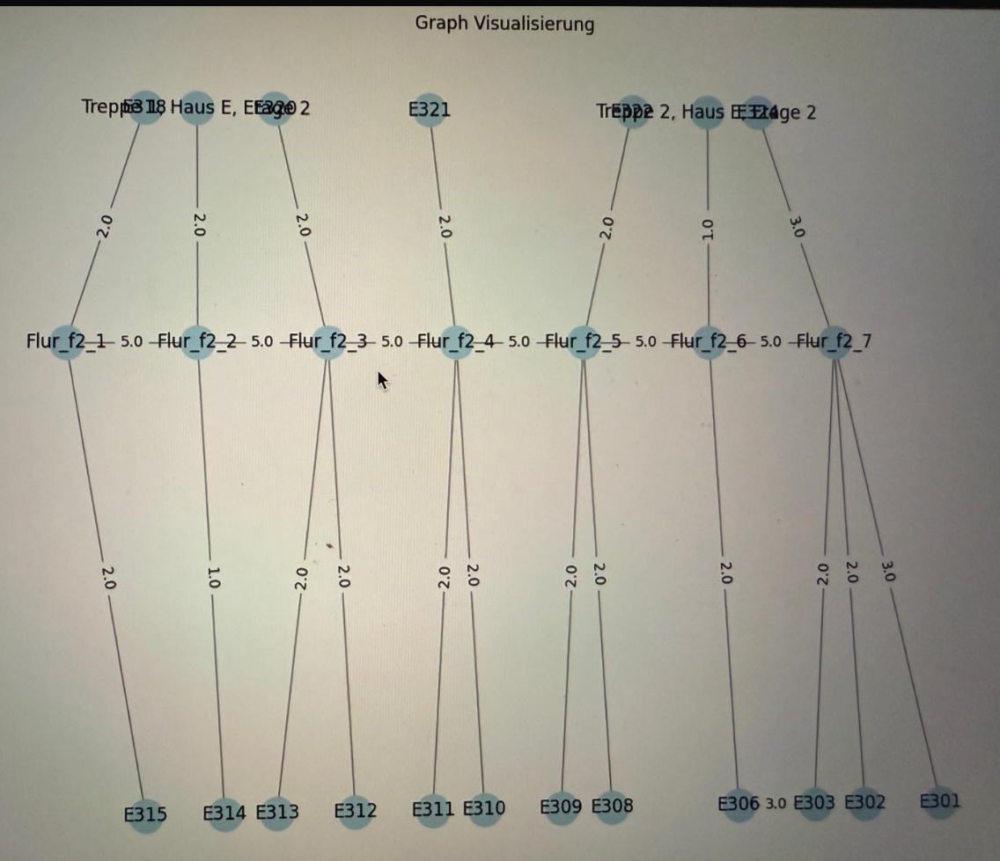
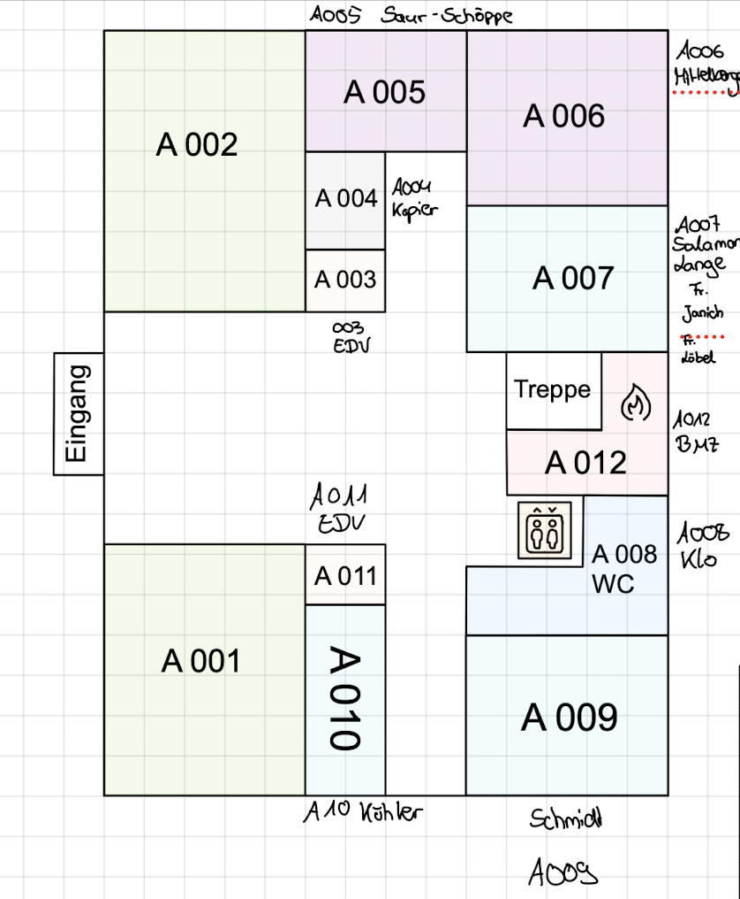
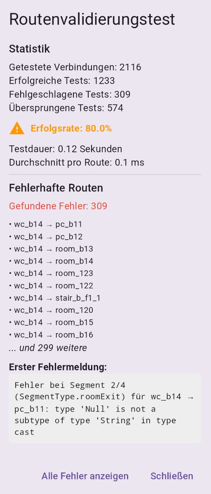

# Campus Navigator (Way2Class)

Diese Flutter-App bietet eine Navigation innerhalb eines Campus-Gebäudes. Mithilfe eines Graphen, der verschiedene Knoten (Räume, Flure, Treppen, Fahrstühle, etc.) repräsentiert, wird der kürzeste Pfad zwischen Start- und Zielpunkt berechnet. Die berechneten Pfade werden anschließend in natürliche, verständliche Wegbeschreibungen umgewandelt – unterstützt durch die Google Generative AI.

## Projektstruktur

- **main.dart:**  
  Der Einstiegspunkt der App, in dem die MaterialApp initialisiert und das Provider-basierte Theme-Management eingerichtet wird. Die HomePage wird als Startseite gesetzt.

- **HomePage:**  
  Die Hauptseite der App mit reaktiver Benutzeroberfläche zum Navigieren auf dem Campus. Bietet Eingabefelder für Start- und Zielpunkt, Schnellzugriffsfunktionen und die Wegbeschreibungsanzeige.

- **Service Layer:**
  - **GraphService:**  
    Implementiert als Singleton, stellt eine zentrale Zugriffsschnittstelle für Graph-Funktionalitäten bereit. Verwaltet das Laden, Caching und die Wiederverwendung von Graph-Daten.
  - **SecurityManager:**  
    Bietet Verschlüsselungsfunktionalität für sensible Daten wie Cache-Inhalte und API-Keys.

- **Graph & Node:**  
  - **Graph:**  
    Enthält die Kernlogik der Navigation - implementiert den A*-Algorithmus zur Pfadfindung, verwaltet das Caching der Routenstrukturen (mit Verschlüsselung) und lädt Graphdaten aus JSON-Dateien.
  - **Node:**  
    Repräsentiert einzelne Knoten im Graphen mit Typinformationen (implementiert als Bitmasken), Koordinaten und Gewichtungen für die Pfadberechnung.

- **NavigationHelper & RouteSegment:**  
  - **NavigationHelper:**  
    Wandelt berechnete Pfade in strukturierte RouteSegment-Objekte um und generiert natürlichsprachliche Wegbeschreibungen.
  - **RouteSegment:**  
    Definiert einzelne Abschnitte einer Route (z.B. "geradeaus gehen", "links abbiegen", "Treppe hoch") mit typsicheren Segmenttypen und zugehörigen Metadaten.

- **UI-Komponenten:**
  - **SearchPanel:** Eingabefelder und Suche für Start- und Zielorte
  - **QuickAccessPanel:** Schnellzugriff auf häufig verwendete Funktionen
  - **RouteDescriptionPanel:** Anzeige der generierten Wegbeschreibungen
  - **DeveloperPanel:** Entwicklerwerkzeuge für Debugging und Tests
  - **GraphViewScreen:** Visualisierung des Campus-Graphen

- **Theme Management:**
  - **ThemeManager:** ChangeNotifier-basierte Klasse zur Verwaltung des App-Themes
  - **LightTheme & DarkTheme:** Separate Konfigurationen für helles und dunkles Erscheinungsbild

- **Hilfsfunktionen:**  
  Zusätzliche Methoden zur Berechnung von Distanzen, Richtungen, Erkennung von Übergängen und zur Optimierung der Cache-Verwaltung.

## Erweiterung
**TODO:**
korrekte daten ins json, system hinter koordinaten und weights erläutern

## Qualitätssicherung und Entwicklungskontrolle

Um sicherzustellen, dass unsere Lösung stets auf dem richtigen Weg bleibt und nicht in falsche Richtungen entwickelt wird, haben wir folgende Maßnahmen implementiert:

### Kontinuierliche Validierung

- **Automatisierte Routentests**: 
  - Implementierung von Tests für alle möglichen Routen im Graphen
  - Validierung der Pfadfindung mit bekannten Start- und Zielpunkten
  - Überprüfung der Wegbeschreibungen auf Korrektheit und Verständlichkeit

  ```dart
  void testAllRoutes() {
    final allNodes = graph.nodeMap.keys.toList();
    int totalRoutes = 0;
    int failedRoutes = 0;
    
    for (String start in allNodes) {
      for (String target in allNodes) {
        if (start != target) {
          totalRoutes++;
          try {
            final path = graph.findPath(start, target);
            if (path.isEmpty) failedRoutes++;
          } catch (e) {
            failedRoutes++;
            print('Fehler bei Route $start -> $target: $e');
          }
        }
      }
    }
    
    print('Getestet: $totalRoutes Routen, Fehler: $failedRoutes');
  }

### Manuelle Feldvalidierung
- Regelmäßige Gebäude-Begehungen zur Datenprüfung
- Sofortige Dokumentation und Korrektur von Abweichungen

### Iterative Entwicklung
- Kurze Zyklen mit realem Nutzerfeedback
- Anpassung auf Basis gesammelter Nutzerbedürfnisse

### Modularität und Architektur
- Klare Trennung von Datenmodell, Algorithmus und UI
- Nutzung austauschbarer, unabhängiger Komponenten

### Code-Qualität
- Regelmäßige Code-Reviews und Pair Programming
- Proaktives Refactoring zur Vermeidung technischer Schulden

### Validierung und Fehlerdokumentation
- Visuelle Pfadprüfung zur Validierung berechneter Ergebnisse
- Dokumentation erkannter Fehler und frühzeitige Reparatur

## Entwicklungstagebuch

### 20. Februar 2025
---
- **Karte als PNG einlesen:**
    Methode implementieren, um PNG in Bytecode umzuwandeln für Gemini Prompt
- **API-Service Gemini:**
    Methode implementieren, um API-Request an Gemini zu schicken mit Bild und Text als Prompt
- **API-Key:**
    API-Key als Umgebungsvariable mit dotenv hinterlegen im .env file 
- **Haus E Teil 1:**
    

### 23. Februar 2025
---
#### Grundlegende UI
- Karte als `InteractiveViewer` im Hintergrund, um Zoomen und Dragging zu ermöglichen
- Zwei `FloatingActionButton` unten rechts: einer öffnet Chat mit Gemini, anderer öffnet Professorentabelle
- `DropdownButton` zur Raumauswahl, anfangs nur Zielraum

### 24. Februar 2025
---
- **Gemini Prompt:**
    Prompt-Generierung und Darstellung des API-Response mit Error-Handling:
    ```dart
    Future<String> _askGemini(String room) async {
        try {
        final model = GenerativeModel(
            model: 'gemini-2.0-flash',
            apiKey: dotenv.env['API_KEY'] ?? 'API Key not found',
        );
        final Uint8List imageBytes = await MapService.loadAssetImage(
            'assets/e_gebaeude.png',
        );
        final prompt = Content.multi([
            TextPart('beschreibe mir kurz wie ich zu Raum $room komme'),
            DataPart('image/png', imageBytes),
        ]);
        final response = await model.generateContent([prompt]);
            return response.text ?? "Keine Antwort erhalten.";
        } on ServerException catch (e) {
            return 'ServerException: ${e.message}';
        } catch (e) {
            return 'Fehler bei der Anfrage: $e';
        }
    }
    ```
- **Darstellung vom Response:**
    Gemini gibt Response im Markdown Format zurück -> Markdown-Widget, um Response sinnvoll zu visualisieren
    ```dart
    FutureBuilder<String>(
        future: _geminiResponse,
        builder: (context, snapshot) {
            if (snapshot.connectionState ==
                ConnectionState.waiting) {
                return const Center(
                    child: CircularProgressIndicator(),
                );
            } else if (snapshot.hasError) {
                return Text(
                    'Fehler: ${snapshot.error}',
                    style: const TextStyle(color: Colors.red),
                );
            } else if (!snapshot.hasData ||
                snapshot.data!.isEmpty) {
                return const Text(
                    "Keine Antwort erhalten.",
                    style: TextStyle(color: Colors.grey),
                );
            } else {
                return Markdown(
                    data: snapshot.data ?? 'Fehler beim Laden',
                );
            }
        },
    )
    ```
### 26. Februar 2025
---
- **Prompt-Erstellung:**
    Experimenteren mit verschiedenen Text-Prompts, um möglichst optimale Wegbeschreibungen von Gemini zu bekommen
- **Error-Handling:**
    Fehlermeldung wenn zu viele Anfragen zu schnell hintereinander getätigt werden (API-Key is limitiert auf etwa 15 pro Minute)
- **Model-Auswahl:**
    Testen, welches Gemini-Model die besten Ergebnisse liefert
### 27. Februar 2025
---
Aufgrund mangelhafter Ergebnisse bei großen Bildern Erleichterung der Arbeit für Gemini, indem Campus zusätzlich als Graph mit Knoten und Verbindungen hinterlegt wird
- Daten als JSON-Datei bereitstellen
- aus JSON Nodes und Edges parsen -> Graph-Objekt erstellen
- Graph zur Überprüfung visualisieren:

- JSON Struktur grob überlegen und testen
- **Graph-Erstellung:**
    Graph-Klasse, die Nodes und Edges aus JSON bezieht und daraus Graphenstruktur baut mit angebenen Distanzen

### 28. Februar 2025
---
- Implementierung Such-Algorithmus für den kürzesten Pfad zwischen zwei Knoten (Räumen) -> Dijkstra
- viele Versuche, Richtung korrekt zu berechnen bei allen Situation:
    - Verlassen Raum/Einrichtung/Treppe/...
    - Flur Abbiegung
    - Betreten Raum/Einrichtung/Treppe/...
- Zusammenfassen von Flurabschnitten bei der Wegbeschreibung
- ungefähre Angabe der Schritte/Meter der Strecke basierend auf Koordinatenabstand der Nodes bzw. Schätzung

- **Graphbasierte Navigation:**  
  Der Campus wird als Graph abgebildet, in dem jeder Knoten für einen Raum oder einen Bereich (z. B. Flur, Treppe, Fahrstuhl) steht. Die Knoten enthalten Bitmasken zur Bestimmung des Typs, der Eigenschaften, des Gebäudes und der Etage.

- **Erst Dijkstra**

- **A\*-Algorithmus:**  
  Zur Pfadberechnung wird der A\*-Algorithmus eingesetzt, um den kürzesten Weg zwischen zwei Knoten im Graphen zu finden.

- **Generative AI für Wegbeschreibungen:**  
  Mithilfe des `google_generative_ai`-Pakets werden die strukturierten Routeninformationen in fließende, natürlichsprachliche Anweisungen umgewandelt.

- **Caching:**  
  Berechnete Pfade und Routenstrukturen werden lokal (über `SharedPreferences`) zwischengespeichert, um wiederholte Berechnungen zu vermeiden und die Performance zu verbessern.
  Verschlüsselung der gecachten Daten (um zb sensible Infos wie Professornamen zu schützen)

- **Autocomplete für Start- und Zielauswahl:**  
  Über Autocomplete-Felder können Start- und Zielknoten einfach ausgewählt werden.

- **Graph Visualisierung:**  
  Eine separate Seite (`GraphViewScreen`) ermöglicht die Visualisierung des Graphen zur besseren Übersicht (optional).

### 5. März 2025
---
- Einstellungsseite UI 
- E-Gebäude Räume abgelaufen und überprüft
- A-Gebäude Erdgeschoss abgelaufen und dokumentiert:

- farbliche Gruppierung der Räume angepasst
- Legende für Farbzuordnung erstellen
- Verschlüsselung der Cache-Daten und des API-Keys mit den packages `flutter_secure_storage` und `encrypt`
- Testroutine zur Verschlüsselung implementiert
- Test aller möglichen Routen implementiert
- langes Debugging wegen Routen-Errors:



### 7. März 2025
---
#### Implementierung von Dark Mode und Theme Management

- **Theme-Manager Architektur**:
  - Implementierung eines `ThemeManager` als ChangeNotifier für reaktives State-Management
  - Integration mit dem Provider-Pattern zur appweiten Theme-Nutzung
  - Methoden zum dynamischen Umschalten zwischen Light- und Darkmode

  ```dart
  class ThemeManager with ChangeNotifier {
    ThemeMode _themeMode = ThemeMode.light;

    ThemeMode get themeMode => _themeMode;
    bool get isDarkMode => _themeMode == ThemeMode.dark;

    void toggleTheme() {
      _themeMode = _themeMode == ThemeMode.light ? ThemeMode.dark : ThemeMode.light;
      notifyListeners();
    }
  }

- **Modularer Aufbau**:
  - Erstellung separater Dateien `light_theme.dart` und `dark_theme.dart`.
  - Vereinfachte Wartbarkeit und Anpassbarkeit durch klare Trennung.
  - Definition zentraler Farbkonstanten für konsistente und leicht verwaltbare Farbpaletten.

- **Light Theme Design**:
  - Basis: Blaugraue Farbpalette (Material Blue Grey) mit Teal-Akzenten.
  - Optimierte Kontraste zur Sicherstellung optimaler Lesbarkeit.
  - Leicht getönter Hintergrund (`#F5F7F9`) für angenehme visuelle Tiefe.
  - Einsatz von subtilen Schatten und erhöhter Elevation zur Schaffung einer klaren visuellen Hierarchie.

- **Dark Theme Design**:
  - Basis: Tiefe dunkle Farbtöne (`#121212`) ergänzt durch helle Akzentfarben.
  - Angepasste Farbkontraste zur Reduktion der Augenermüdung.
  - Orientierung an Material Design Dark Theme Guidelines für optimale Lesbarkeit.
  - Reduzierte Elevation-Effekte für ein flacheres und modernes Erscheinungsbild.

- **UI-Komponenten für Theme-Wechsel**:
  - Implementierung eines Icon-Buttons in der AppBar zum schnellen Wechsel zwischen Themes.
  - Kontextabhängige Icons (Sonne/Mond) zur klaren visuellen Indikation des aktuellen Modus.
  - Zusätzlicher Theme-Toggle im Schnellzugriffsbereich der Anwendung für eine intuitive Bedienung.

- **Gestaltung der Tabelle der Professoren:**
    - HTML-Seite einlesen
    - Die Daten der Tabelle extrahieren -> schauen, wo genau die Daten sind in html-Code- Ansicht
    - zunächst als Liste ausgeben lassen -> Erst nur Name
    - Umbau zu Tabelle
    - Drop-Down, weil Tabelle zu breit -> nur Anzeige Name und Raum, dann weitere Infos
    - Automatische Anpassung an Breite der Seite